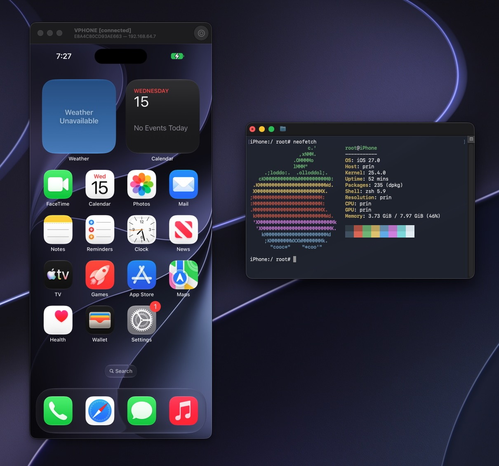

<div align="right"><a href="../README.md">English</a> · <a href="README_zh.md">中文</a> · <strong>日本語</strong> · <a href="README_ko.md">한국어</a></div>

# vphone-cli

Apple Silicon Mac で仮想 iPhone を実行します。



vphone-cli は Apple の Virtualization.framework と PCC 研究用仮想マシンを使って iOS を実行します。セキュリティ研究、リバースエンジニアリング、デバッグに適しています。

- **グラフィカルウィンドウ**：Mac 上で仮想 iPhone の画面を操作し、App とファイルを閲覧し、スクリーンショットの撮影や画面収録ができます。
- **カスタムファームウェア（Custom Firmware）**：システムにはあらかじめパッチが適用されており、パッケージ環境をインストールできます。
- **バックアップと複製**：仮想マシンの書き出し、読み込み、複製ができます。
- **自動化 API**：任意で有効にできる、ローカルの HTTP と WebSocket のインターフェースです。
- **追加の依存なし**：実行時に Xcode、Python、Homebrew は不要です。

> 1.x については [1.0.14 Release](https://github.com/Lakr233/vphone-cli/releases/tag/1.0.14) をご覧ください。2.x では 1.x で作成した仮想マシンを起動できないため、作り直す必要があります。

## 準備

- macOS 15 以降を搭載した物理 Apple Silicon Mac。macOS の仮想マシン上では使用できません。
- 十分なディスク容量。仮想マシンごとに標準で 64 GB の仮想ディスクを使用し、ファームウェアと一時ファイルにも別途容量が必要です。
- ネットワーク接続。システムの復元時に署名チケットをオンラインで取得します。
- セキュリティ設定の変更。macOS 復旧モードに入り、ターミナルで次のコマンドを実行してから再起動します。

  ```sh
  csrutil enable --without debug
  csrutil allow-research-guests enable
  ```

  SIP は有効のまま、デバッグの制限だけを緩和します。理由と別の設定方法は[ホストの設定](Guides/host-setup.md)をご覧ください。

## クイックスタート

1. 最新の [vphone-launchpad](https://github.com/Lakr233/vphone-cli/releases/latest)（`vphone-launchpad-<バージョン>.zip`）をダウンロードし、展開して開きます。
2. **Host Setup** で開発者ツールへのアクセスを許可し、ヘルパーをインストールします。
3. **Core Bundle** で **Download and Install** をクリックします。Launchpad が `VPhone.bundle` をダウンロードして検証し、その中の仮想マシン用プログラムがこの Mac で実行できるようにします。
4. **Machines** で **New Machine** をクリックし、ファームウェアの組み合わせを選んで **Create** をクリックします。

Launchpad がファームウェアのダウンロード、パッチの適用、システムの復元、初回起動を行います。完了後も仮想マシンは実行されたままです。

自分の iPhone と cloudOS の IPSW を使うこともできます。検証済みの組み合わせは[互換性ガイド](Guides/compatibility.md)をご覧ください。

## パッケージ環境のインストール

仮想マシンには標準でパッケージマネージャが入っていません。インストール手順は次のとおりです。

1. メニューバーで **Apps > Install Bootstrap…** を選び、レイアウトとして **roothide** を選択します（**rootless** は非推奨です）。仮想マシンに Irisin がインストールされます。
2. 初回のインストールでは、Irisin で `apt` と `bash` にチェックを入れ、インストールボタンを長押しして **Bootstrap Install** を選びます。`bash` と `debianutils` は相互に依存しているため、通常のインストールでは完了できません。
3. 以降は通常のインストールで構いません。

環境を削除するには **Apps > Uninstall Bootstrap…** を選びます。削除後、仮想マシンは再起動します。

Option キーを押しながら **Apps** メニューを開くと、さらに 2 つの項目があります。

- **Install Bootstrap from File…**：ローカルの Irisin `.deb` を使ってインストールします。
- **Uninstall Bootstrap Without Restarting…**：仮想マシンを再起動せずに環境を削除します。

## コマンドライン

Launchpad は `VPhone.bundle` 内の `vphone-cli` を使って仮想マシンを管理しています。ターミナルから直接使うこともできます。

| 操作 | コマンド |
| --- | --- |
| 仮想マシンの一覧表示 | `vphone-cli vm list` |
| 仮想マシンの情報表示 | `vphone-cli vm info myphone` |
| 仮想マシンの起動 | `vphone-cli vm launch myphone` |
| 仮想マシンの停止 | `vphone-cli vm stop myphone` |
| 仮想マシンの複製 | `vphone-cli vm clone myphone copy` |
| 仮想マシンの書き出し | `vphone-cli vm export myphone --out myphone.tzst` |
| 仮想マシンの読み込み | `vphone-cli vm import myphone.tzst --name restored` |

仮想マシンは標準で `~/.vphone/` に保存されます。すべてのコマンドは `vphone-cli <group> --help` で確認できます。Launchpad を使わずに仮想マシンを作成する方法は[作成と実行](Guides/create-and-run.md)をご覧ください。

### 自動化 API

起動時に `--api-listen` を指定すると有効になります。

```sh
vphone-cli vm launch myphone --api-listen 127.0.0.1:8765
# 出力に [api] token: … と表示されます
curl -H "Authorization: Bearer $TOKEN" http://127.0.0.1:8765/v1/health
```

token は起動のたびに新しく生成されます。token を固定するには、環境変数 `VPHONE_API_TOKEN` を設定してください。token のないリクエストと Web ページからのリクエストは、どちらも拒否されます。インターフェースの説明は [API ドキュメント](../Research/vphoned_http_api.md)をご覧ください。

## 問題が起きたら

まず[トラブルシューティング](Guides/troubleshooting.md)をご覧ください。仮想マシン用プログラムがシステムに拒否される、復元に失敗する、「Press home to continue」で止まる、といった状況を扱っています。それでも解決しない場合は、[issue を送信](https://github.com/Lakr233/vphone-cli/issues)してください。

## ドキュメント

| ドキュメント | 内容 |
| --- | --- |
| [ホストの設定](Guides/host-setup.md) | SIP と AMFI の設定、ソースからのビルド、環境の確認 |
| [作成と実行](Guides/create-and-run.md) | ファームウェアの入手元、作成の流れ、ストレージとバックアップ |
| [互換性ガイド](Guides/compatibility.md) | 検証済みのファームウェアの組み合わせ |
| [トラブルシューティング](Guides/troubleshooting.md) | よくあるエラーと対処方法 |
| [Launchpad コマンドライン](Guides/launchpad-cli.md) | `vphone-launchpad-cli` でローカルビルドをインストールしてテストする |
| [研究記録](../Research/README.md) | パッチと実装の詳細 |

## プロジェクト構成

- `vphone-launchpad`：Mac App です。`VPhone.bundle` のダウンロードとインストール、ホストの設定を行います。別途配布されます。
- `vphone-cli`：ファームウェアの準備、パッチの適用、システムの復元、仮想マシンの管理を行います。
- `vphone-vm`：仮想マシンを実行し、仮想マシンのウィンドウを表示します。
- `vphoned`：仮想マシン内の制御サービスです。ウィンドウの機能と API は、すべてこれを通じて実現されています。

| パス | 内容 |
| --- | --- |
| [`VPhoneExecutable/`](../VPhoneExecutable/) | `vphone-cli`、`vphone-vm`、ファームウェアパッチと復元 |
| [`VPhoneKit/`](../VPhoneKit/) | ホスト側の共有ライブラリと API クライアント |
| [`VPhoneDaemon/`](../VPhoneDaemon/) | `vphoned` |
| [`VPhoneGuestComponents/`](../VPhoneGuestComponents/) | 仮想マシン内のフックと補助プログラム |
| [`VPhoneLaunchpad/`](../VPhoneLaunchpad/) | Launchpad App とそのヘルパー |

ソースからのビルド：`xcodebuild -workspace VPhone.xcworkspace -scheme VPhone build`。成果物は `VPhone.bundle` です。

## 謝辞

- [wh1te4ever/super-tart-vphone-writeup](https://github.com/wh1te4ever/super-tart-vphone-writeup)
